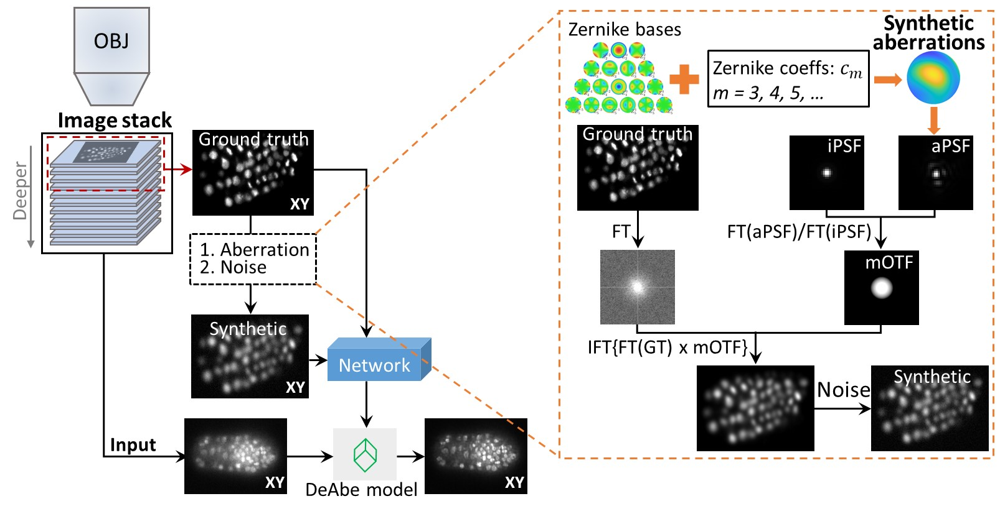

# DeAbePlus

‘DeAbePlus encompasses deaberration and resolution enhancement for fluorescence microscopy based on deep learning. It is companion code for our paper: [Deep learning-based aberration compensation improves contrast and resolution in fluorescence microscopy](https://www.biorxiv.org/content/10.1101/2023.10.15.562439v2).
 

## System requirements

- Windows 10 or Linux OS. 
- Most graphics cards currently available from Nvidia (as of this writing, 5/26/2024) should be compatible with CUDA 10, but best to [check here](https://developer.nvidia.com/cuda-gpus).
- CUDA 10.0 and cuDNN 7.6.5

### Dependencies

- Python: version 3.7.0 or later.
- MATLAB: version R2020b or later.
- 3D-RCAN: a 3D version of deep residual channel attention network (RCAN). Open resources can be found from [this Github repository](https://github.com/AiviaCommunity/3D-RCAN). 
- CARE: a toolbox for content-aware restoration (CARE) of (fluorescence) microscopy images. Installation and introduction can be found on [this website](https://csbdeep.bioimagecomputing.com/doc/).
- diSPIMFusion: a code package to perform deconvolution and multiview fusion for microscopy images. Installation and introduction can be found on [this Github repository](https://github.com/eguomin/diSPIMFusion).

### Tested environment

- Windows 10 workstation
    - CPU: Intel Xeon, Platinum 8369B, two processors; 
    - RAM: 256 GB; 
    - GPU: NVIDIA GeForce RTX 3090 with 24 GB memory; 
- Python 3.7.0 
- MATLAB R2022b.

### Installation

Install from Github:
`git clone https://github.com/eguomin/DeAbePlus`

## Overall workflow

The package contains comprehensive codes of ImageJ macros, MATLAB scripts, and Python scripts. The ImageJ macros provide a user-friendly interface of image inspection, background removal, and cropping. The MATLAB scripts offer the functions to generate training data pairs. The Python scripts handle the network training and prediction.

### 1. DeAbe model

- Model training
        
    1) Preprocess the raw image stacks, including image background removal, cropping, and extracting the shallow subvolumes. This can be done manually with GUI based image processing software (e.g, ImageJ), or automatically with user customized code. The repository provides an ImageJ macro `ImageCrop.ijm` for reference. 
   
    2) Generate the degraded images from the shallow subvolumes (or alternately from aberration-free phantom objects or experimental images) with synthetic aberrations. The repository provides several MATLAB scripts/functions for this operation, including `test_gen_simu_3Dimage.m`, `gen_simu_3Dimage.m` *etc*.

    3) Train the DeAbe model with 3D-RCAN network. The repository provides command files to call and run the python code. Users may also refer to the [3D-RCAN](https://github.com/AiviaCommunity/3D-RCAN) repository for more instructions.
    
- Model apply

    Once the DeAbe model is trained, we can use it to ameliorate the effect of aberrations by applying it to new data unseen by the networks. 

### 2. Multi-step pipeline

- Model training
        
    Step 1: train the **DL DeAbe** model as described above. 
        
    Step 2: train the **DL Decon** model. 
        
     1) Jointly deconvolve the multiview images (after applying the DeAbe model to each single view) using `diSPIMFusion` code to get ground truth for the Decon model training. Users may also refer to the [diSPIMFusion](https://github.com/eguomin/diSPIMFusion) repository for more instructions.

     2) Use de-aberrated single view images (after applying the DeAbe model) and ground truth images (i.e., jointly deconvolved multiview images as described in the previous step) as training data pairs, and train the Decon model with 3D-RCAN network.

    Step 3: train the **DL Iso** model or **DL Expan** model.
    
    - **DL Iso** model

        Train the model with CARE network. The repository provides command file `cmd_CARE_Iso.bat` to call and run the python code. Users need to set the parameter "training_trigger" as *true* and "prediction_trigger" as *false*. Users may also refer to the [CARE](https://csbdeep.bioimagecomputing.com/doc/) website for more instructions.

    - **DL Expan** model
    
        1) Generate expansion training data pairs with code `expanded_embryo_sythetic.m` as described in paper [[1]](#1). 
        
        2) Train the Decon model with 3D-RCAN network.
    
- Model apply

     The repository provides command file `cmd_apply_multi_steps.bat` to handle the multiple step model prediction.

    - If Step 3 is **DL Iso** model:
    
        1) See the parameters "step1_trigger" and "step2_trigger" as *true*, and "step3_trigger" as *false*.

        2) Run the command file `cmd_CARE_Iso.bat` with the parameter "training_trigger" as *false* and "prediction_trigger" as *true*.

    - If Step 3 is **DL Expan** model:
    
        Run the code `cmd_apply_multi_steps.bat` with Parameters "step1_trigger", "step2_trigger" and "step3_trigger" all set as *true*.

## Practice on test data
 
 Example experimental datasets for model training and prediction are available at [Zenodo](https://doi.org/10.5281/zenodo.8424245). Here we provide a brief guidance on running the code on both synthetic phantom objects and experimental data.

 - **Test on synthetic phantom objects**
                
     1) Run the code `test_create_rd_mix_objects.m` within MATLAB. This code creates three-dimensional phantoms consisting of randomly oriented and positioned dots, lines, spheres, spherical shells, and circles. 

     2) Run the code `test_gen_simu_3Dimage_synObj.m` within MATLAB. This code generate both the aberration-free (Ground Truth, GT) and aberrated (Aberrated, Raw) images from the phantom objects. Users may use it to generate training data pairs (e.g., 50 phantoms with 10 sets of aberrations for each phantom by default) and test data pairs. Users will need to set the input and output paths.
     
     3) Configure the parameters for the model training in `config_DeAbe_synObj.json`. Users need to set training data paths.

     4) Run the training command file `cmd_train_DeAbe_synObj.bat`. Users need to set the 3D-RCAN path, parameter file path, and the model output path.

     5) Run the prediction command file `cmd_apply_DeAbe.bat`. Users need to set the model path, input data path, output data path, and optionally bit depth (e.g., 16 or 32), block size (e.g., 256x256x256). 
     
    All parameters have been configured for the test data by default.

 - **Test on experimental data**
                
     1) Download the experimental data `PtK2_fixedCell.zip` from [Zenodo](https://doi.org/10.5281/zenodo.8424245). The data are fixed cells with an actin label, imaged with a with a lattice light sheet microscope. There are 50 stack images for generating training pairs, and 1 stack image (along with AO corrected image) for test. 

     2) Run the code `test_gen_simu_3Dimage_expData.m` within MATLAB. This code generates the aberrated images (Aberrated, Raw) from the aberration-free images (Ground Truth, GT). By default each image was added with 10 sets of aberrations. Users will need to set the input and output paths.
     
     3) Configure the parameters for the model training in `config_DeAbe_expData.json`. Users need to set training data paths.

     4) Run the training command file `cmd_train_DeAbe_expData.bat`. Users need to set the 3D-RCAN path, parameter file path, and the model output path.

     5) Run the prediction command file `cmd_apply_DeAbe.bat`. Users need to set the model path, input data path, output data path, and optionally bit depth (e.g., 16 or 32), block size (e.g., 256x256x256). 

    All parameters have been configured for the test data by default.

## References

<a id="1">[1]</a>
Jiji Chen, *et al*. (2021).
"[Three-dimensional residual channel attention networks denoise and sharpen fluorescence microscopy image volumes](https://www.nature.com/articles/s41592-021-01155-x)." Nature Methods 18 (2021): 678–687
